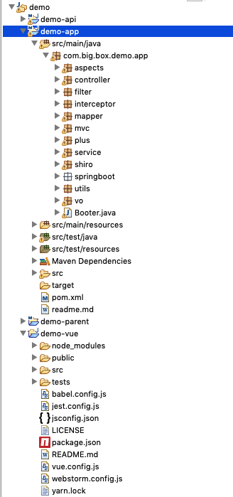
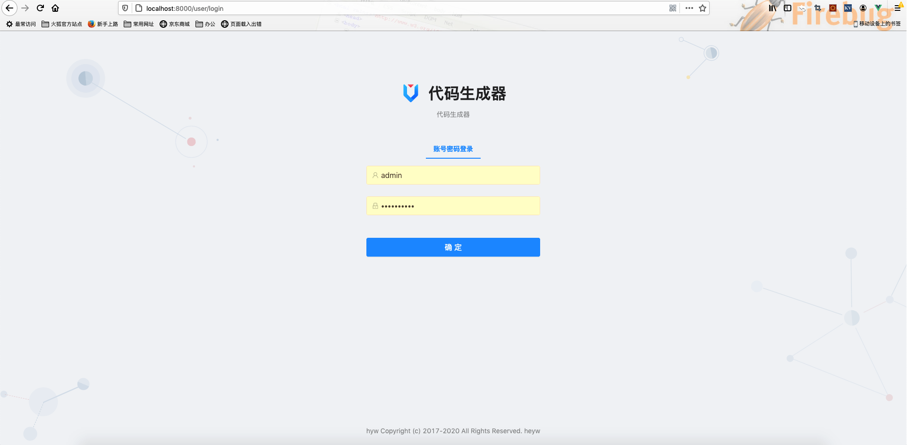
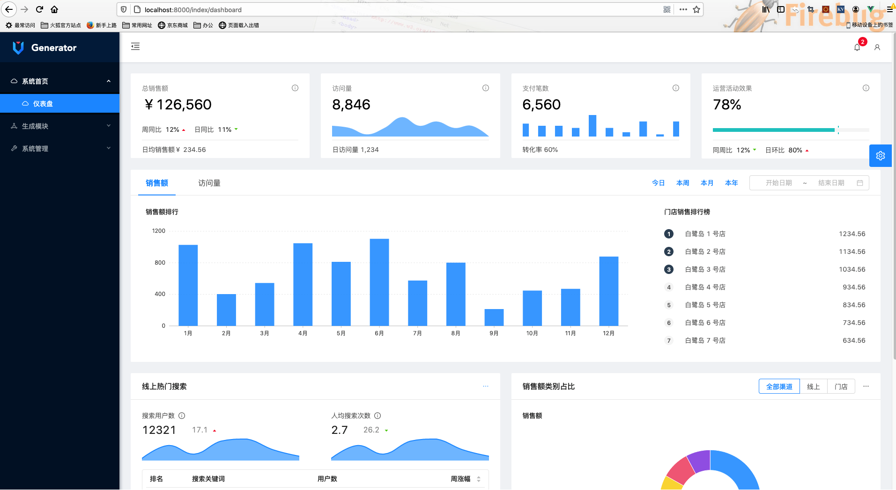
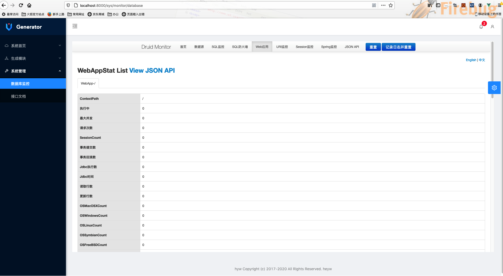
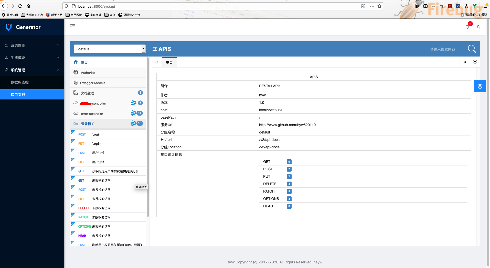

## 一、简介
最小代码生成器/脚手架，可全自动生成前后台工程和代码，提高开发效率

### 主要功能：

- 支持主流关系型数据库(mysql、oracle、postgresql、sqlserver)
- 支持整库生成、指定部分表、反选表生成(数据库表支持复合主键)
- 支持构建脚本生成(gradle/maven/不生成)
- 支持多模块工程的生成,模块名可自定义配置
- 支持模板自定义,排版风格支持自定义,java类注释支持自定义(更改模板文件comment.vm)
- 支持组件扩展，组件特性自定义及特性扩展

### 技术组件：

- 前端页面：ant design pro vue、thymeleaf
- 用户认证鉴权:jwt、shiro
- 流量哨兵(流量控制)：sentinel
- 分布式配置&注册中心&接口限流规则：zookeeper
- 分布式服务治理：dubbo
- 微服务：springboot、springcloud alibaba
- 分布式消息中间件rocketmq
- 分布式缓存：redis集群&切片缓存
- APM系统(分布式实时数据链路追踪):skywalking、zipkin
- 持久层：mybatis/mybatis-plus、 JPA

### 生成器版本
- 命令行版生成器（工程下的cmd目录）
- JAVA工程版（工程下的core目录）
- web工程版(工程下的web目录，TODO)

选择其中一个版本执行即可，推荐命令行版(使用简单)

## 二、快速开始

### 1、命令行版生成器

- [release](https://github.com/hyw520110/generator/releases/)下载最新zip包或通过源码构建获取zip包（工程根目录下执行：mvn clean package，在cmd工程target目录下获取zip包）
- 解压zip包，到任意目录
- 执行bin目录下的命令脚本startup.bat或startup.sh
- 根据命令行提示，输入数据源配置和生成配置（生成目录、根包等）,一般只需输入数据源配置，其他配置直接回车保持默认即可

### 2、JAVA版生成器

#### 2.1、生成器配置(generator.yaml)：

			  
	url: jdbc:mysql://localhost:3306/test?useUnicode=true&autoReconnect=true&characterEncoding=UTF-8
	username: root
	pwd: 123456
    
	outputDir: /output/test
	rootPackage: com.test
以上为必须修改的配置项 ,其他均为可选修改项，更多可选配置项说明见配置文件注释或以下说明

#### 2.2、生成代码：

- 导入源码到IDE(安装配置好maven/gradle)
- 修改生成器配置文件generator.yaml
- 执行Generator的main方法.

## 三、应用服务启动
	
代码生成完成后，资源管理器会自动打开生成路径,默认包含后台工程和前台工程(vue)
### 1、后台工程初始化

如配置的组件中不包含zookeeper，则默认是本地配置文件(application.yml)，根据需要修改配置或完全保持默认配置

如配置的组件中包含zookeeper，则推荐使用zookeeper分布式配置（非必须），初始化zookeeper配置数据：

- 进入生成的源码根目录下的app目录,打开src/test/resources/zookeeper.data全选复制
- cmd进入zookeeper的bin目录下执行 zkCli -server localhost:2181 粘贴 回车

### 2、启动后台服务

- 把生成的源码导入IDE(maven/gradle工程)，执行Boot.java启动服务，服务启动完成后自动打开浏览器(profile为dev时)
- 或者通过maven/gradle命令构建zip包，解压zip包到任意目录，进入bin目录，执行启动脚本启动服务（以默认模块配置api、app为例）：
	- 进入parent目录，执行mvn package
	- 进入app目录下的target目录，解压zip包到任意目录
	- 进入解压目录,如需修改配置,则先修改配置,否则直接进入bin目录,执行start.bat启动服务,服务启动完成后自动打开浏览器(profile为dev时)

### 3、启动前端工程
如组件包含vue(默认配置)时，会自动生成vue工程,命令行进入生成目录下的vue目录，执行：

	yarn install 
	yarn run serve

## 四、系统预览及配置介绍

生成的前后端工程：

vue(ant design pro vue)登录页面：

主页面菜单:

数据库监控:

swagger定制化接口文档:

生成器配置文件generator.yaml,主要配置包括(粗体必须配置):

- **数据源配置**：driverClassName、URL、username、pwd
- **全局配置**：生成目录outputDir、是否清空输出目录delOutputDir、是否覆盖生成fileOverride、技术组件components
- **生成策略配置**：根包rootPackage
- 组件配置:如组件选配了dubbo、zipkin、zookeeper、rocketmq、redis等,需指定组件所需的地址,否则一般保持默认即可

说明：

1. 默认生成多模块工程，也可生成单模块工程，配置modules即可，如默认生成api和app多模块工程，配置：

		modules: [ 'api','app']
	
2. 其中components组件配置一般保持默认即可，如需定制选取根据注释进行配置即可（比如需要生成页面，配置VUE或THYMELEAF即可），如需修改组件相应配置（如redis、dubbo、zookeeper、rocketmq等组件的默认地址信息)，直接在生成器配置文件中修改组件配置的默认值即可

## 五、自定义特性
- 自定义工程构建工具：maven(pom.xml)、gradle(build.gradle)、无

- 自定义工程模块，支持生成单工程和多模块工程，多模块工程，工程模块名可自定义

- 父类自定义：dao、service、controller层的父类自定义，在配置文件中指定即可

- 自定义文件名： entity、dao、service、contrller层的类名及配置文件名支持自定义生成

- 自定义模板:

	- 复制templates目录重命名,修改模板文件
	- 在配置文件中修改模板目录名

- 扩展组件:

	- 在配置文件中指定模块名数组(modules),如模块配置为[api,app],已有的组件配置为[mybatis,springmvc],新增dubbo配置:[mybatis,springmvc,dubbo]
	- 在模板目录(templates)下新建目录，目录名为{模块数组index},如dubbo的配置文件在app模块中，则新建{2}文件夹,在文件夹下新建（文件夹）模板文件
	- 在配置文件中新增组件配置(非必须),配置模板所需的配置信息

- 更多自定义特性，查看生成器配置文件或源码...

	
	
# 六、TODO LIST:

1. 各主流关系型数据库驱动包集成及验证（默认只集成mysql驱动包，其他数据库集成相应的数据库驱动包即可）

2. 增加分布式消息中间件

3. redis切片緩存key优化：演示功能，设置过于简单 ,需考虑唯一性以及序列化与反序列化

# 七、FAQ:

1. 启动服务(生成的应用服务)报错：

	ClassCastException: java.lang.UnsupportedClassVersionError cannot be cast to [Ljava.lang.Object;
	- 原因：
	- 指定生成jdk1.8配置，而运行环境的jdk版本低于1.8
	- 解决：
		- 安装jdk1.8/jre1.8,并设置环境变量
		- 或者在pom中指定jdk为1.7，并去掉zipkin数据追踪依赖、mq消息中间件依赖