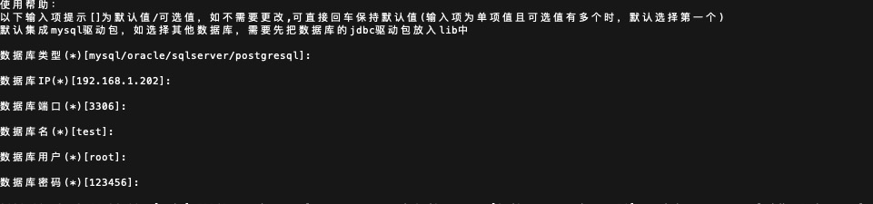
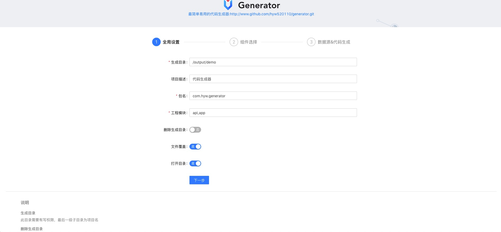
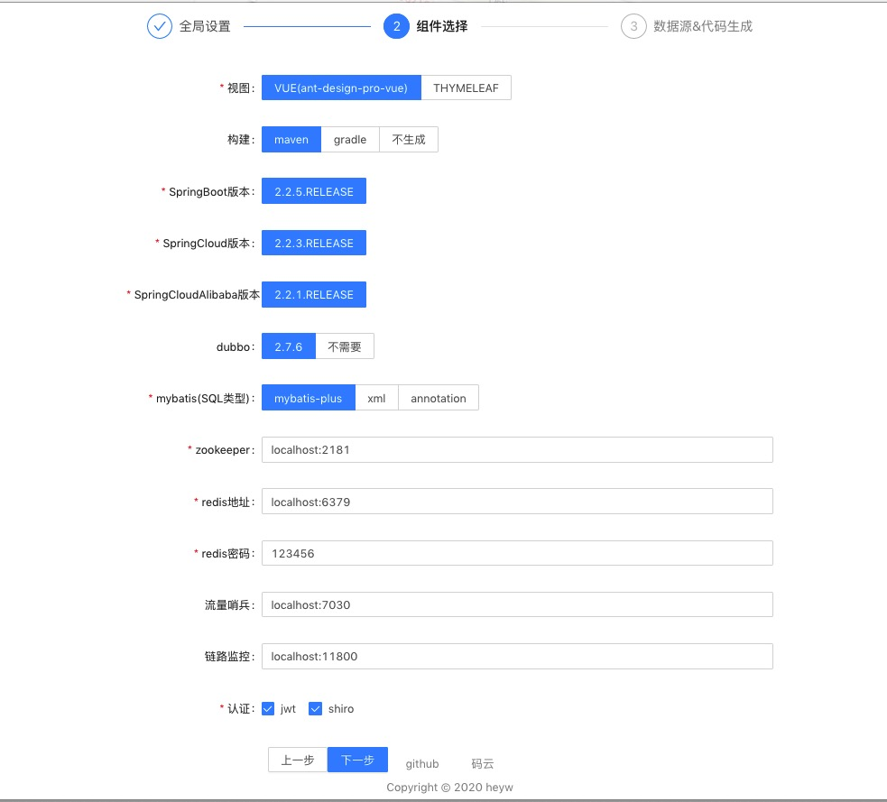
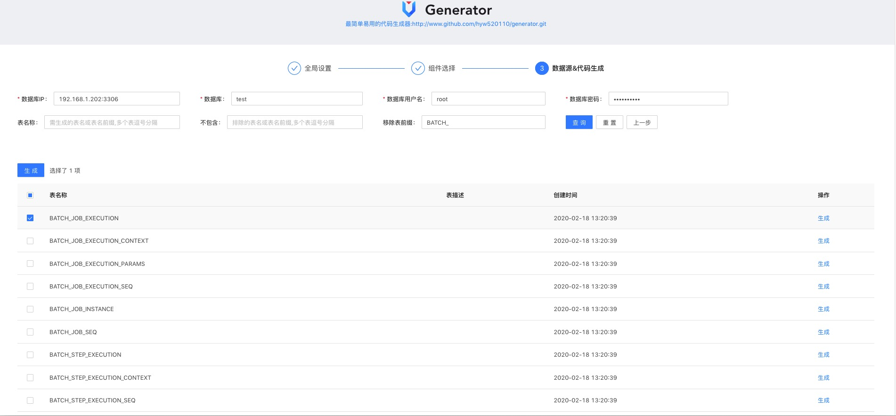
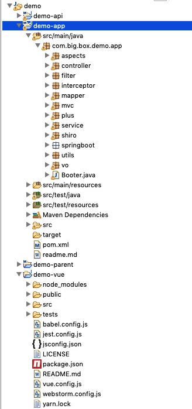
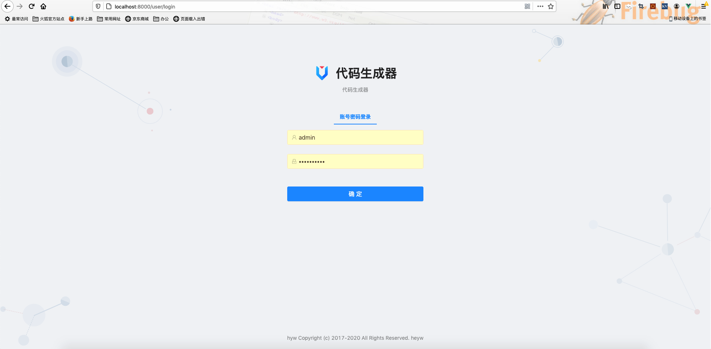
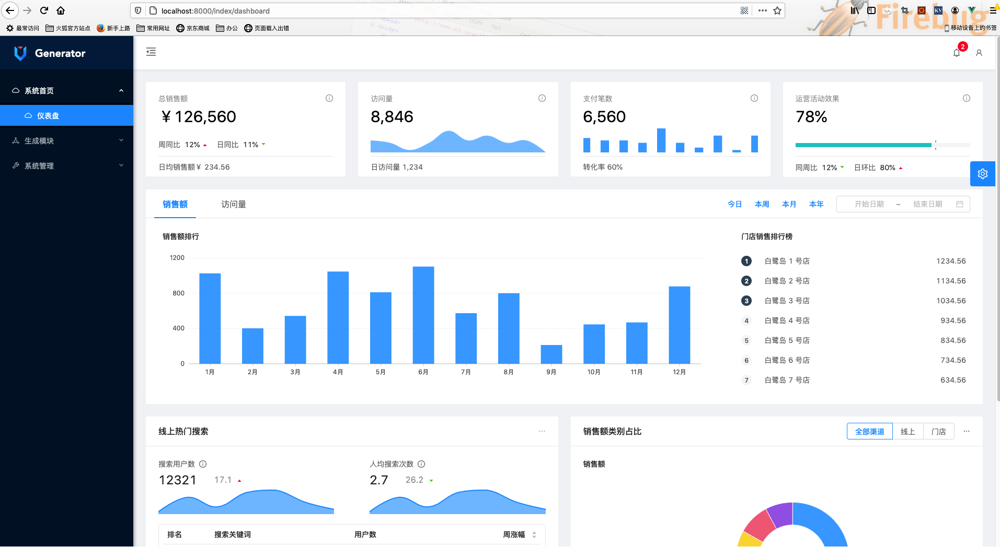
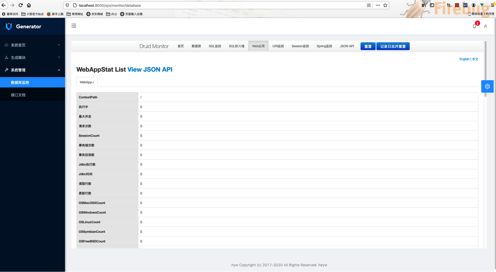
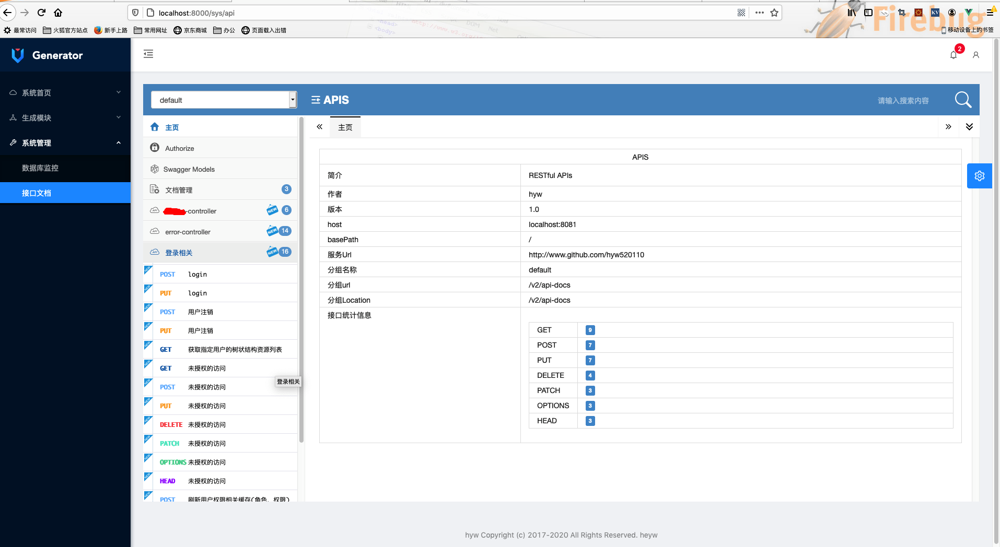

## 一、简介

**代码生成器/脚手架**，可全自动生成前后台工程和代码，提高开发效率。

只需配置数据源和生成参数，即可一键生成完整的前后端项目代码，包含：
- **后端工程**：Spring Boot/Spring Cloud 微服务架构
- **前端工程**：Vue + Ant Design Pro 或 Thymeleaf 模板
- **完整功能**：用户认证、权限管理、CRUD 接口、页面、API 文档等

### 主要功能：

- **数据库支持**：主流关系型数据库 (MySQL、Oracle、PostgreSQL、SQLServer)
- **表生成策略**：整库生成、指定部分表生成、排除指定表生成 (支持复合主键)
- **构建工具**：支持 Gradle、Maven 或不生成构建脚本
- **多模块工程**：支持单工程和多模块工程，模块名可自定义配置
- **模板自定义**：排版风格、Java 类注释支持自定义 (修改 `comment.vm` 模板文件)
- **组件扩展**：组件特性自定义及扩展
- **双模板引擎**：FreeMarker / Velocity，可根据项目技术栈选择

### 模板引擎说明：

本项目支持两种模板引擎，模板文件命名规范：

- **FreeMarker 模板**：文件扩展名为 `.ftl`，语法示例：`<#if condition>...</#if>`
- **Velocity 模板**：文件扩展名为 `.vm`，语法示例：`#if(condition)...#end`

在 `generator.yaml` 中通过 `templateEngine` 配置项切换引擎：

```yaml
global:
  # 模板引擎类型，可选值：freemarker, velocity
  templateEngine: freemarker
```

**注意**：模板文件必须使用正确的扩展名，否则会被当作普通文件直接复制，导致条件判断等模板语法不生效。

### 技术组件：

- **前端页面**：ant design pro vue、thymeleaf
- **用户认证鉴权**：jwt、shiro
- **流量哨兵 (流量控制)**：sentinel
- **分布式配置&注册中心&接口限流规则**：zookeeper
- **分布式服务治理**：dubbo
- **微服务**：springboot、springcloud alibaba
- **分布式消息中间件**：rocketmq
- **分布式缓存**：redis 集群&切片缓存
- **APM 系统 (分布式实时数据链路追踪)**：skywalking、zipkin
- **持久层**：mybatis/mybatis-plus、JPA

### 生成器版本

- **命令行版**：交互式命令行，使用简单
- **JAVA 版**：IDE 中运行，适合集成到现有项目
- **Web 版**：可视化界面，操作直观

选择其中一个版本执行即可，推荐**命令行版**(使用简单)

### Web 版操作说明

1. **启动服务**后访问：`http://localhost:8000/generator/code`

2. **三步完成代码生成**：
   - **步骤 1：全局设置** - 配置生成目录、包名、工程模块等（带 * 为必填项）
   - **步骤 2：组件选择** - 选择视图类型、构建工具、框架版本、中间件等
   - **步骤 3：数据源&代码生成** - 配置数据库连接，查询表，选择表后点击生成

3. **错误提示**：生成失败时，错误消息显示在生成按钮同一行

### 预览图

**cmd 版：**


**web 版：**




**生成的前后端工程：**


**Vue(ant design pro vue) 登录页面：**


**主页面菜单：**


**数据库监控：**


**Swagger 定制化接口文档：**


---

## 二、快速开始

### 环境要求

- **JDK 版本**：JDK 17 或更高版本
- **构建工具**：Maven 3.6+ 或 Gradle 7.0+
- **数据库**：MySQL 5.7+ / Oracle 11g+ / PostgreSQL 9.6+ / SQL Server 2016+
- **Node.js**：14.0+（生成 Vue 前端工程时需要）

---

### 1、命令行版生成器

1. **获取程序**：通过 [release](https://github.com/hyw520110/generator/releases/) 下载最新 zip 包，或通过源码构建：
   ```bash
   # 工程根目录下执行
   mvn clean package
   ```
   在 cmd 工程 target 目录下获取 zip 包

2. **解压**：解压 zip 包到任意目录

3. **运行**：执行 `bin` 目录下的命令脚本：
   - Windows: `run.bat`
   - Linux/Mac: `run.sh`

4. **配置**：根据命令行提示，输入数据源配置和生成配置（生成目录、根包等）
   - 一般只需输入数据源配置，其他配置直接回车保持默认即可

---

### 2、Web 版生成器

1. **构建并启动：**
   ```bash
   # 进入项目根目录
   cd generator
   
   # 方式一：使用 Docker（推荐）
   docker-compose up -d
   
   # 方式二：直接运行
   ./package.sh  # 打包
   java -jar cmd/target/generator-*.jar  # 启动
   ```

2. **访问页面：**
   ```
   http://localhost:8000/generator/code
   ```

3. **操作步骤：**
   - **步骤 1：全局设置** - 配置生成目录、包名、工程模块等（带 `*` 为必填项）
   - **步骤 2：组件选择** - 选择视图类型、构建工具、框架版本、中间件等
   - **步骤 3：数据源&代码生成** - 配置数据库连接，选择表，点击生成

---

### 3、JAVA 版生成器

#### 3.1 生成器配置 (generator.yaml)：

```yaml
# 以下必须修改
url: jdbc:mysql://localhost:3306/test?useUnicode=true&autoReconnect=true&characterEncoding=UTF-8
username: root
pwd: 123456

outputDir: /output/test
rootPackage: com.test
```

以上为必须修改的配置项，其他均为可选修改项，更多可选配置项说明见配置文件注释

#### 3.2 生成代码：

1. 导入源码到 IDE(安装配置好 maven/gradle)
2. 修改生成器配置文件 `generator.yaml`
3. 执行 `Generator.java` 的 `main` 方法

---

## 三、应用服务启动

代码生成完成后，资源管理器会自动打开生成路径，默认包含后台工程和前台工程 (vue)

### 1、后台工程初始化

**如配置的组件中不包含 zookeeper**，则默认是本地配置文件 (`application.yml`)，根据需要修改配置或完全保持默认配置

**如配置的组件中包含 zookeeper**，则推荐使用 zookeeper 分布式配置（非必须），初始化 zookeeper 配置数据：

1. 进入生成的源码根目录下的 `app` 目录
2. 打开 `src/test/resources/zookeeper.data` 全选复制
3. cmd 进入 zookeeper 的 bin 目录下执行：
   ```bash
   zkCli -server localhost:2181
   # 粘贴内容后回车
   ```

### 2、启动后台服务

**方式一：IDE 启动**
- 把生成的源码导入 IDE(maven/gradle 工程)
- 执行 `Boot.java` 启动服务
- 服务启动完成后自动打开浏览器 (profile 为 dev 时)

**方式二：命令行启动**
1. 进入 `parent` 目录，执行 `mvn package`
2. 进入 `app` 目录下的 `target` 目录，解压 zip 包到任意目录
3. 进入解压目录，如需修改配置，则先修改配置
4. 进入 `bin` 目录，执行启动脚本：
   ```bash
   # Windows
   start.bat
   
   # Linux/Mac
   ./start.sh
   ```
   服务启动完成后自动打开浏览器 (profile 为 dev 时)

### 3、启动前端工程

如组件包含 vue(默认配置) 时，会自动生成 vue 工程

本地环境需要先安装 [node](https://nodejs.org/en/)，然后命令行进入生成目录下的 `vue` 目录，执行：

```bash
yarn install
yarn run serve
```

---

## 四、自定义特性

### 1. 自定义工程构建工具
- maven (pom.xml)
- gradle (build.gradle)
- 无

### 2. 自定义工程模块
- 支持生成单工程和多模块工程
- 多模块工程的模块名可自定义

### 3. 父类自定义
- dao、service、controller 层的父类自定义
- 在配置文件中指定即可

### 4. 自定义文件名
- entity、dao、service、controller 层的类名及配置文件名支持自定义生成

### 5. 自定义模板

1. 复制 `templates` 目录重命名，修改模板文件
2. 在配置文件中修改模板目录名

### 6. 扩展组件

1. 在配置文件中指定模块名数组 (`modules`),如模块配置为 `[api,app]`,已有的组件配置为 `[mybatis,springmvc]`,新增 dubbo 配置:`[mybatis,springmvc,dubbo]`
2. 在模板目录 (`templates`) 下新建目录，目录名为 `{模块数组 index}`,如 dubbo 的配置文件在 app 模块中，则新建 `{2}` 文件夹，在文件夹下新建（文件夹）模板文件
3. 在配置文件中新增组件配置 (非必须),配置模板所需的配置信息

### 7. 更多自定义特性
查看生成器配置文件或源码...

---

# 五、TODO LIST

1. 各主流关系型数据库驱动包集成及验证（默认只集成 mysql 驱动包，其他数据库集成相应的数据库驱动包即可）
2. 增加分布式消息中间件 rocketmq、kafka
3. redis 切片缓存 key 优化：示例设置过于简单，需考虑唯一性以及序列化与反序列化

---

# 六、FAQ

### 1. GitHub 图片不显示

**解决方案**：修改 hosts 文件，添加以下内容：

```
199.232.28.133 raw.githubusercontent.com
199.232.68.133 gist.githubusercontent.com
199.232.28.133 cloud.githubusercontent.com
199.232.28.133 camo.githubusercontent.com
199.232.28.133 avatars0.githubusercontent.com
199.232.68.133 avatars1.githubusercontent.com
199.232.28.133 avatars2.githubusercontent.com
199.232.68.133 avatars3.githubusercontent.com
199.232.68.133 avatars4.githubusercontent.com
199.232.68.133 avatars5.githubusercontent.com
199.232.68.133 avatars6.githubusercontent.com
199.232.68.133 avatars7.githubusercontent.com
199.232.68.133 avatars8.githubusercontent.com
```

### 2. 启动服务报错：ClassCastException

**错误信息：**
```
java.lang.UnsupportedClassVersionError cannot be cast to [Ljava.lang.Object;
```

**原因：**
指定生成 jdk1.8 配置，而运行环境的 jdk 版本低于 1.8

**解决方案：**
- 安装 jdk1.8/jre1.8，并设置环境变量
- 或者在 pom 中指定 jdk 为 1.7，并去掉 zipkin 数据追踪依赖、mq 消息中间件依赖

---

## 七、架构设计与优化建议

为了持续提升生成器的专业性、健壮性与执行效率，本项目在架构层面遵循以下优化准则：

### 1. 模板引擎抽象化 (Strategy Pattern)
- **细节**：通过定义 `TemplateEngine` 接口解耦具体的渲染引擎（Freemarker/Velocity）
- **逻辑**：`Generator` 不再直接操作具体引擎，而是通过工厂模式根据配置动态加载实现类，便于未来扩展如 Thymeleaf 或 Enjoy 引擎

### 2. 并行化渲染驱动
- **细节**：利用 Java 8+ 的 `ParallelStream` 对表元数据进行并发处理
- **逻辑**：在多核 CPU 环境下，将百级别表的生成耗时从秒级降低至毫秒级，通过 `CompletableFuture` 协同处理 IO 与 CPU 密集型任务

### 3. 数据源深度配置透传
- **细节**：在 `generator.yaml` 中开放 Druid 连接池的高级参数（如 `maxActive`, `minIdle`, `maxWait`）
- **逻辑**：针对大型数据库或复杂 SQL 导入场景，优化连接持有效率，防止在高并发生成时连接枯竭

### 4. 元数据缓存策略
- **细节**：集成 Caffeine 缓存并提供可配置的开关机制
- **逻辑**：通过 `global.enableCache` 配置或 `--no-cache` 命令行参数，平衡"频繁修改表结构"与"快速重复生成"的性能需求

### 5. 统一路径解析协议 (PathResolver)
- **细节**：废弃不直观的 `%s` 或 `{0}` 占位符，统一采用 `${table.beanName}` 等标准表达式
- **逻辑**：通过专用 `PathResolver` 实现路径的预处理，使模板路径配置更加语义化且易于维护

### 6. 智能资源识别机制
- **细节**：结合文件扩展名与 Magic Number (文件头) 自动判定资源文件
- **逻辑**：无需手动在 `resources` 中枚举所有二进制格式，系统自动识别并执行二进制拷贝，避免非文本文件进入渲染引擎导致损坏

### 7. 模板预编译缓存
- **细节**：在执行生成前，预先解析 `components` 下的常驻模板并缓存在内存中
- **逻辑**：消除循环渲染各表时的重复磁盘 IO 与语法解析开销，显著提升吞吐量

### 8. 配置模块化 (Include Config)
- **细节**：支持 `include: [sub-configs]` 语法
- **逻辑**：允许将庞大的 `generator.yaml` 拆分为数据库配置、组件配置等多个模块，提高大型项目配置的可维护性

### 9. 依赖版本中心化管理
- **细节**：在 `global.versions` 下集中定义所有第三方库版本
- **逻辑**：确保生成的所有子模块（API, APP, Vue）引用的版本严格一致，消除版本冲突隐患

### 10. 原子性生成保护
- **细节**：引入临时目录生成与最终替换机制
- **逻辑**：生成过程中的任何异常均不会污染目标目录，只有全部任务成功后才会更新输出结果，保证生成工程的原子性

### 11. 跨平台诊断工具 (EnvChecker)
- **细节**：内置 `EnvChecker` 诊断逻辑
- **逻辑**：启动时自动检查 JDK 版本、系统字符集、目录权限等关键指标，提供精准的中文故障诊断提示

### 12. 静态资源共享与零开销分发
- **细节**：在 `templates` 下设立独立的 `assets` 目录，存放跨引擎共用的静态文件（图片、脚本、样式）
- **逻辑**：生成器在初始化阶段通过专用 IO 流将其全量分发至目标工程，不经过模板引擎解析，既实现了资源去重，又规避了静态文件中的语法干扰
