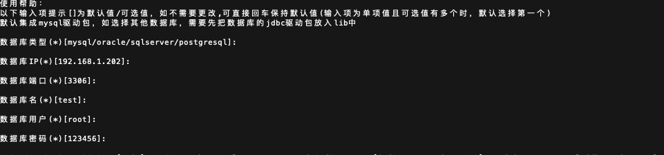
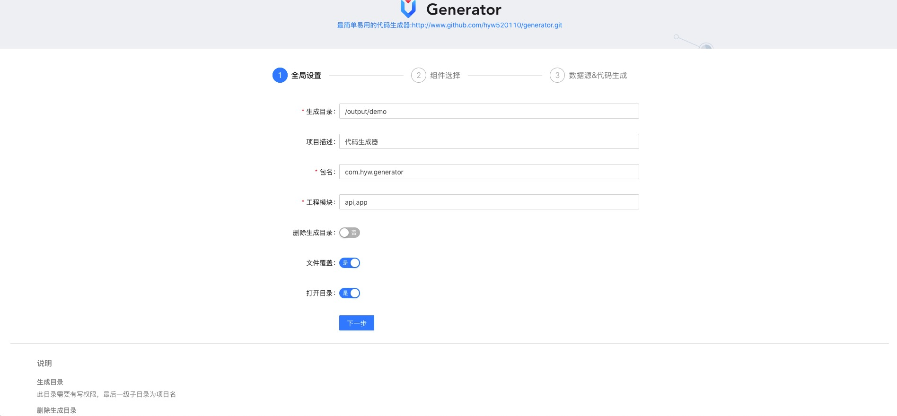
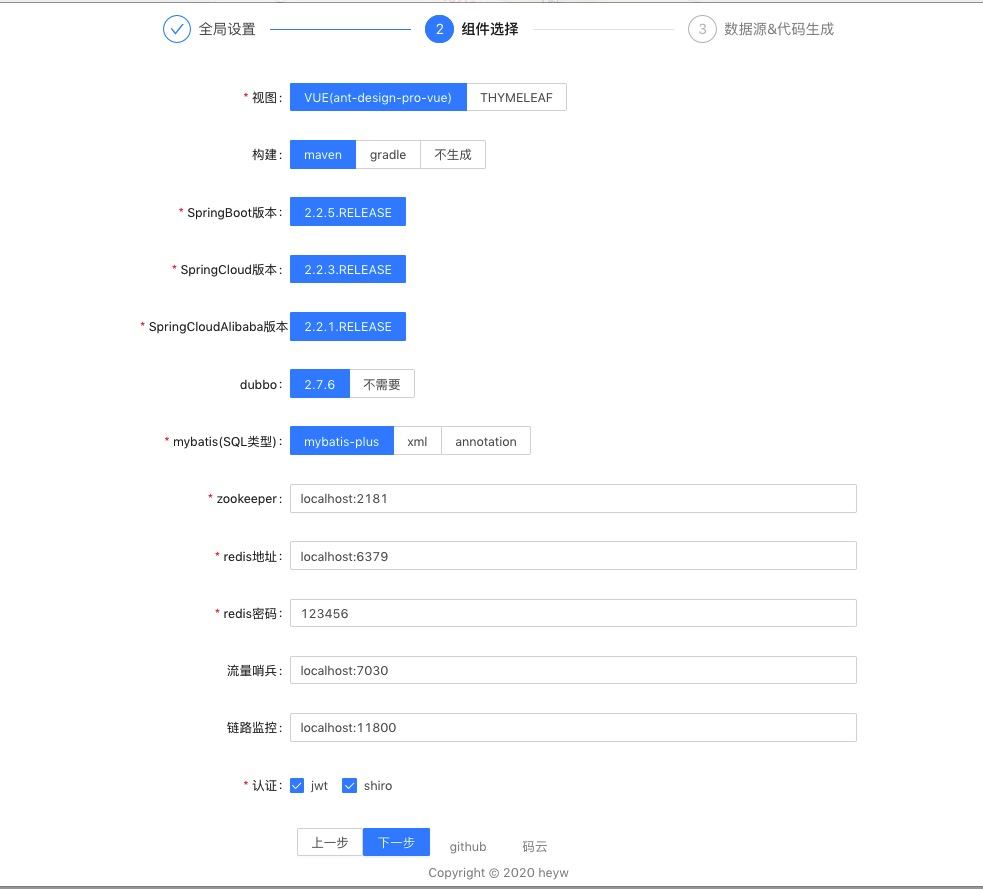
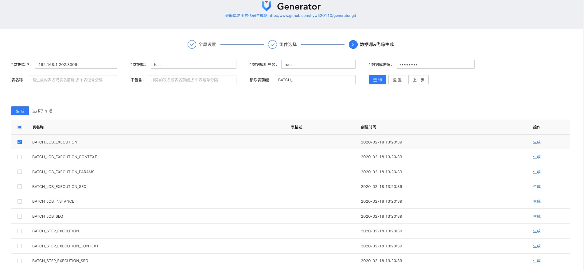
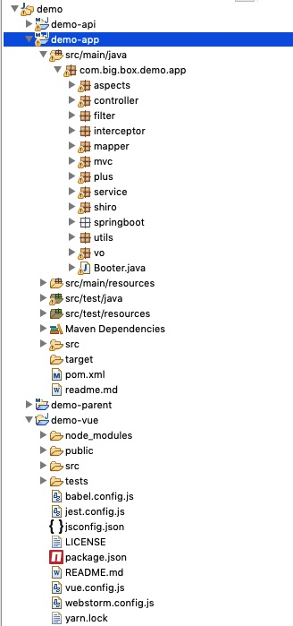
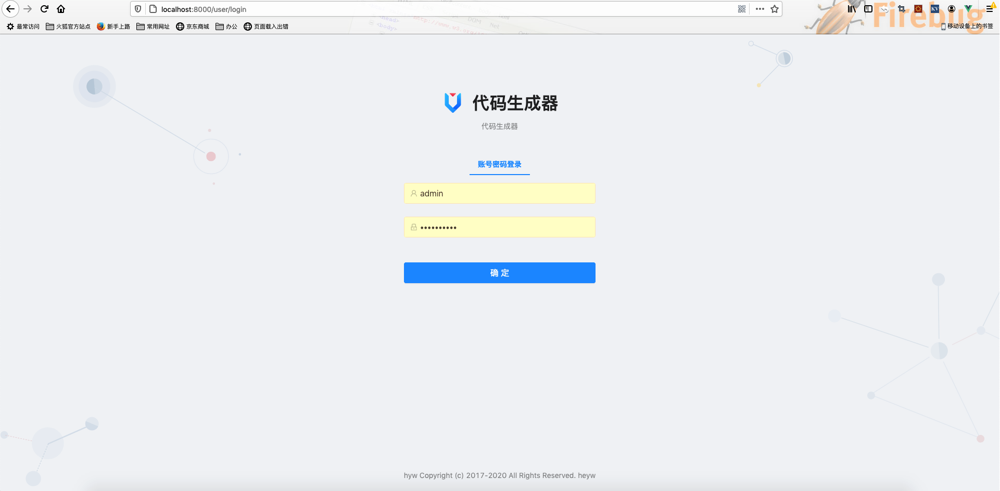
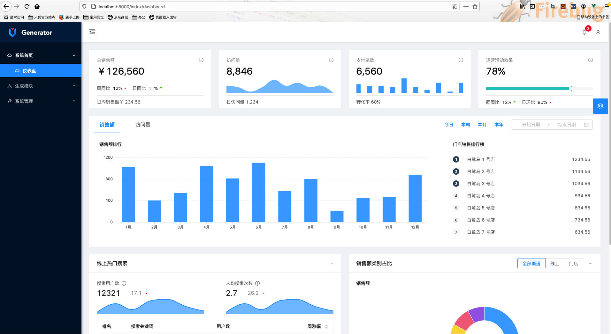
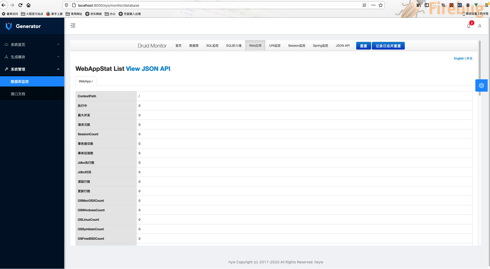
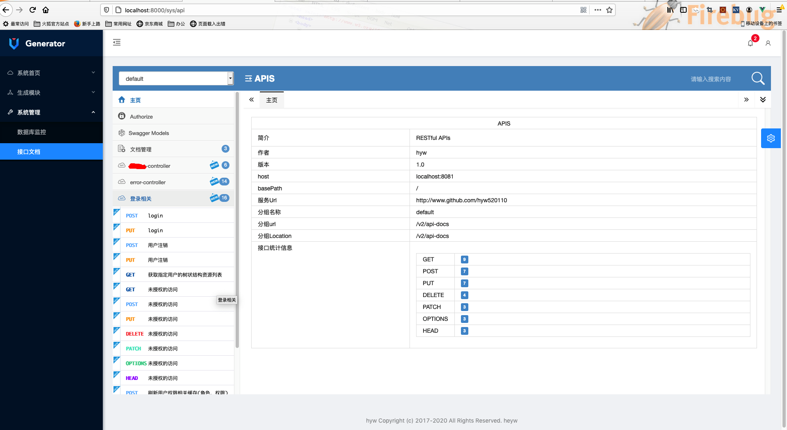

## 一、简介

**代码生成器/脚手架**，可全自动生成前后台工程和代码，提高开发效率。只需配置数据源和生成参数，即可一键生成完整的前后端项目代码，包含：

- **后端工程**：Spring Boot/Spring Cloud 微服务架构
- **前端工程**：Vue + Ant Design Pro 或 Thymeleaf 模板
- **完整功能**：用户认证、权限管理、CRUD 接口、页面、API 文档等

###  核心架构与特性

不仅支持基础 CRUD，更能一键拼装 17+ 项顶级微服务特性：

- **底层安全与鉴权**：全面拥抱 `Spring Security 6.x` + `OAuth2` 现代安全架构体系（或 `Shiro` 排他性选型），无状态 `JWT` 认证。
- **高阶业务能力 (Feature)**：内置 `WORKFLOW` (Flowable 工作流与发起接口)、`EXCEL` (海量报表一键导出)、`AUDITLOG` (AOP 自动操作日志)、`TENANT` (多租户隔离)、`DATAPERMISSION` (数据权限过滤)。
- **微服务治理与高并发**：深度整合 `SEATA` (Service 层 `@GlobalTransactional` 自动绑定)、`MULTIDATASOURCE` (自动化的 `@DS("slave")` 读写分离路由)、`MULTICACHE` (阿里 JetCache 双路高并发缓存)、`SENTINEL` (限流降级)。
- **DevOps 与云原生部署**：自动化生成 Dockerfile、K8s 清单与 Github Actions / Gitlab-CI 流水线脚本 (`CICD` & `DEVOPS` 支持)。
- **前端 Vue 深度整合**：Vue 前端模板已深度打通业务流，自动生成带图标的“导出 Excel”与“发起审批”业务入口，自动按需装载 API 接口。

### 基础功能：

- **数据库支持**：主流关系型数据库 (MySQL、Oracle、PostgreSQL、SQLServer)
- **表生成策略**：整库生成、指定部分表生成、排除指定表生成 (支持复合主键)
- **构建工具**：支持 Gradle、Maven 或不生成构建脚本
- **多模块工程**：支持单工程和多模块工程，模块名可自定义配置
- **模板自定义**：排版风格、Java 类注释支持自定义 (修改 `comment.vm` 模板文件)
- **组件扩展**：组件特性自定义及扩展
- **双模板引擎**：FreeMarker / Velocity，可根据项目技术栈选择
- **表关系图**：可视化展示数据库表之间的外键关系，支持实线/虚线区分必选/可选关系
- **数据库文档导出**：支持导出 Word (.docx) 和 PDF 格式的数据库表结构文档

### 模板引擎说明：

本项目支持两种模板引擎，模板文件命名规范：

- **FreeMarker 模板**：文件扩展名为 `.ftl`，语法示例：`<#if condition>...</#if>`
- **Velocity 模板**：文件扩展名为 `.vm`，语法示例：`#if(condition)...#end`

在 `generator.yaml` 中通过 `templateEngine` 配置项切换引擎：

```yaml
global:
  # 模板引擎类型，可选值：freemarker, velocity
  templateEngine: freemarker
```

**注意**：模板文件必须使用正确的扩展名，否则会被当作普通文件直接复制，导致条件判断等模板语法不生效。

### 技术组件：

- **前端页面**：ant design pro vue、thymeleaf
- **用户认证鉴权**：jwt、shiro
- **流量哨兵 (流量控制)**：sentinel
- **分布式配置&注册中心&接口限流规则**：zookeeper
- **分布式服务治理**：dubbo
- **微服务**：springboot、springcloud alibaba
- **分布式消息中间件**：rocketmq
- **分布式缓存**：redis 集群&切片缓存
- **APM 系统 (分布式实时数据链路追踪)**：skywalking、zipkin
- **持久层**：mybatis/mybatis-plus、JPA

### 生成器版本

- **命令行版**：交互式命令行，使用简单
- **JAVA 版**：IDE 中运行，适合集成到现有项目
- **Web 版**：可视化界面，操作直观

选择其中一个版本执行即可，推荐**命令行版**(使用简单)

### Web 版操作说明

1. **启动服务**后访问 Web 前端：`http://localhost:9000/generator/code`（后端 API 默认端口：`8081`）

2. **三步完成代码生成**：
   - **步骤 1：全局设置** - 配置生成目录、包名、工程模块等（带 * 为必填项）
   - **步骤 2：组件选择** - 选择视图类型、构建工具、框架版本、中间件等
   - **步骤 3：数据源&代码生成** - 配置数据库连接，查询表，选择表后点击生成

3. **生成文档**：在步骤 3 中，点击"生成文档"下拉菜单可导出：
   - **生成 Word 文档**：导出 `.docx` 格式的数据库表结构文档
   - **生成 PDF 文档**：导出 `.pdf` 格式的数据库表结构文档

4. **表关系图**：在步骤 3 中，点击"关系图"下拉菜单可查看：
   - **选中表关系图**：显示已选中表之间的关系
   - **所有表关系图**：显示整个数据库的表关系

5. **错误提示**：生成失败时，错误消息显示在生成按钮同一行

### 预览图

**cmd 版：**


**web 版：**




**生成的前后端工程：**


**Vue(ant design pro vue) 登录页面：**


**主页面菜单：**


**数据库监控：**


**Swagger 定制化接口文档：**


---

## 二、快速开始

### 环境要求

- **运行默认生成器包**：JDK 8+
- **源码构建生成器**：JDK 17+（core 使用 MRJAR 编译 Java 17 增强实现，推荐 JDK 21）
- **构建工具**：Maven 3.6+ 或 Gradle 7.0+
- **数据库**：MySQL 5.7+ / Oracle 11g+ / PostgreSQL 9.6+ / SQL Server 2016+
- **Node.js**：17.9.1+（运行 Web 前端或生成 Vue 前端工程时需要）

---

### 1、命令行版生成器

1. **获取程序**：通过 [release](https://github.com/hyw520110/generator/releases/) 下载最新 zip 包，或通过源码构建：
   ```bash
   # 工程根目录下执行
   mvn clean package
   ```
   在 cmd 工程 target 目录下获取 zip 包

2. **解压**：解压 zip 包到任意目录

3. **运行**：执行 `bin` 目录下的命令脚本：
   - Windows: `run.bat`
   - Linux/Mac: `run.sh`

4. **配置**：根据命令行提示，输入数据源配置和生成配置（生成目录、根包等）
   - 一般只需输入数据源配置，其他配置直接回车保持默认即可

---

### 2、Web 版生成器

1. **构建并启动：**
   ```bash
   # 进入项目根目录
   cd generator
   
   # 方式一：使用 Docker 启动后端 API
   docker-compose up -d
   
   # 方式二：直接运行
   ./package.sh  # 默认打包 generator-web.jar（Java 8 / Spring Boot 2 运行包）
   java -jar web/target/generator-web.jar  # 启动后端 API，默认端口 8081
   
   # 前端开发服务
   cd web/antd
   yarn install
   yarn dev
   ```

   生成器自身支持按运行时分代打包：

   ```bash
   # 显式生成 Java 8 / Spring Boot 2 运行包
   ./package.sh --tool-runtime=boot2 -m web
   java -jar web/target/generator-web-boot2.jar
   
   # 生成 Java 17+ / Spring Boot 3 运行包
   ./package.sh --tool-runtime=boot3 -m web
   java -jar web/target/generator-web-boot3.jar
   
   # 依次生成 boot2 和 boot3 两个运行包
   ./package.sh --tool-runtime=all -m web
   ```

   说明：
   - 默认构建保持 Java 8 / Spring Boot 2，降低本地运行门槛。
   - `tool-boot3` 使用同一套 `javax` 源码，在构建期生成临时 Jakarta 源码到 `web/target/generated-sources/jakarta`，再用 Spring Boot 3 依赖打包；不会修改源码目录。
   - 生成器自身的运行 JDK 与生成出来的目标工程 JDK 解耦：Java 8 运行的生成器也可以生成 Java 17/21 + Spring Boot 3 工程。

2. **访问页面：**
   ```
   http://localhost:9000/generator/code
   ```

   后端健康检查/API 配置地址：
   ```
   http://localhost:8081/v1/gen/health
   http://localhost:8081/v1/gen/config
   ```

   Web 版默认使用“全局默认配置 + 用户配置”的方式保存配置：
   - 全局默认配置：`${user.home}/.generator/default.yml`
   - 用户配置目录：`${user.home}/.generator/users`
   - 默认用户识别策略：`app.user-config-strategy=ip`
   - 可选策略：`ip`、`client`、`session`
   - 密码默认不落盘：`app.persist-password=false`

   局域网多人使用时，推荐配置：
   ```yaml
   app:
     user-config-strategy: client
     persist-password: false
   ```
   前端会为浏览器生成稳定 `GENERATOR_CLIENT_ID`，并通过请求头和 Cookie 传给后端；下载文件也会按用户配置隔离。

   Docker 部署时可挂载持久化目录：
   ```yaml
   volumes:
     - ./data:/app/data
     - ./downloads:/app/downloads
   ```

3. **操作步骤：**
   - **步骤 1：全局设置** - 配置生成目录、包名、工程模块等（带 `*` 为必填项）
   - **步骤 2：组件选择** - 选择视图类型、构建工具、框架版本、中间件等
   - **步骤 3：数据源&代码生成** - 配置数据库连接，选择表，点击生成

---

### 3、JAVA 版生成器

#### 3.1 生成器配置 (generator.yaml)：

```yaml
# 以下必须修改
url: jdbc:mysql://localhost:3306/test?useUnicode=true&autoReconnect=true&characterEncoding=UTF-8
username: root
pwd: 123456

outputDir: /output/test
rootPackage: com.test
```

以上为必须修改的配置项，其他均为可选修改项，更多可选配置项说明见配置文件注释

#### 3.2 Java 兼容版本矩阵

生成器通过 `core/src/main/resources/compatibility.yml` 统一维护 Java 版本和框架/组件版本的兼容关系。命令行版、Web 版和模板渲染共用同一份矩阵。

用户通常只需要配置：

```yaml
global:
  javaVersion: 17
```

支持 `8`、`11`、`17`、`21`。生成器会自动匹配 Spring Boot、Spring Cloud、MyBatis、MyBatis-Plus、Knife4j、Shiro 等版本，并向模板注入 `templateFamily`、`namespace`、`servletPackage`、`validationPackage` 等变量。

当前默认档位：
- `java8-boot2`：Java 8 / Spring Boot 2 / `javax`
- `java11-boot2`：Java 11 / Spring Boot 2 / `javax`
- `java17-boot3`：Java 17 / Spring Boot 3 / `jakarta`
- `java21-boot3`：Java 21 / Spring Boot 3 / `jakarta`
- `java17-boot2`：Java 17 / Spring Boot 2 过渡档，需显式配置 `platformId`

需要明确指定兼容档位时，可配置 `platformId`。不配置时，生成器会按 `javaVersion` 使用默认档位：

```yaml
global:
  javaVersion: 21
  platformId: java21-boot3
```

安全方案推荐通过 `security` 表达用户意图，由生成器自动映射到 `components` / `features`：

```yaml
global:
  # Boot2 后台管理可选
  security: SHIRO

  # Boot3 默认推荐
  security: SPRING_SECURITY_OAUTH2
```

推荐策略：
- `java8-boot2` / `java11-boot2`：可选 `SHIRO` 或 `SPRING_SECURITY_OAUTH2`
- `java17-boot3` / `java21-boot3`：默认推荐 `SPRING_SECURITY_OAUTH2`
- `SHIRO` 作为 Boot2 方案保留；Boot3 场景如需 Shiro 2.x，建议作为后续高级兼容档单独验证

如需小版本覆盖，只能覆盖 `compatibility.yml` 中 `allowOverride` 允许的版本项：

```yaml
versionOverrides:
  SPRINGBOOT:
    springboot_version: 3.2.13
  MYBATIS:
    mybatis_plus_version: 3.5.8
```

#### 3.3 常用高级配置

```yaml
# 顶层 include 用于拆分配置文件，被 include 的配置先加载，当前文件覆盖同名配置
include:
  - ./conf/datasource.yml
  - ./conf/components.yml

global:
  # 只生成指定表；exclude 优先级更高
  include: [user, order]
  exclude: [sys_log]

  # 多表并行渲染，默认 true；排查模板副作用或希望稳定串行输出时可关闭
  parallelTables: true

  # 模拟生成，执行完整解析和渲染流程但不写入文件，适合验证配置和模板
  dryRun: false
```

#### 3.4 生成代码：

1. 导入源码到 IDE(安装配置好 maven/gradle)
2. 修改生成器配置文件 `generator.yaml`
3. 执行 `Generator.java` 的 `main` 方法

---

## 三、应用服务启动

代码生成完成后，资源管理器会自动打开生成路径，默认包含后台工程和前台工程 (vue)

### 1、后台工程初始化

**如配置的组件中不包含 zookeeper**，则默认是本地配置文件 (`application.yml`)，根据需要修改配置或完全保持默认配置

**如配置的组件中包含 zookeeper**，则推荐使用 zookeeper 分布式配置（非必须），初始化 zookeeper 配置数据：

1. 进入生成的源码根目录下的 `app` 目录
2. 打开 `src/test/resources/zookeeper.data` 全选复制
3. cmd 进入 zookeeper 的 bin 目录下执行：
   ```bash
   zkCli -server localhost:2181
   # 粘贴内容后回车
   ```

### 2、启动后台服务

**方式一：IDE 启动**
- 把生成的源码导入 IDE(maven/gradle 工程)
- 执行 `Boot.java` 启动服务
- 服务启动完成后自动打开浏览器 (profile 为 dev 时)

**方式二：命令行启动**
1. 进入 `parent` 目录，执行 `mvn package`
2. 进入 `app` 目录下的 `target` 目录，解压 zip 包到任意目录
3. 进入解压目录，如需修改配置，则先修改配置
4. 进入 `bin` 目录，执行启动脚本：
   ```bash
   # Windows
   start.bat
   
   # Linux/Mac
   ./start.sh
   ```
   服务启动完成后自动打开浏览器 (profile 为 dev 时)

### 3、启动前端工程

如组件包含 vue(默认配置) 时，会自动生成 vue 工程

本地环境需要先安装 [node](https://nodejs.org/en/)，然后命令行进入生成目录下的 `vue` 目录，执行：

```bash
yarn install
yarn run serve
```

---

## 四、自定义特性

### 1. 自定义工程构建工具
- maven (pom.xml)
- gradle (build.gradle)
- 无

### 2. 自定义工程模块
- 支持生成单工程和多模块工程
- 多模块工程的模块名可自定义

### 3. 父类自定义
- dao、service、controller 层的父类自定义
- 在配置文件中指定即可

### 4. 自定义文件名
- entity、dao、service、controller 层的类名及配置文件名支持自定义生成

### 5. 自定义模板

1. 复制 `templates` 目录重命名，修改模板文件
2. 在配置文件中修改模板目录名

### 6. 扩展组件

1. 在配置文件中指定模块名数组 (`modules`),如模块配置为 `[api,app]`,已有的组件配置为 `[mybatis,springmvc]`,新增 dubbo 配置:`[mybatis,springmvc,dubbo]`
2. 在模板目录 (`templates`) 下新建目录，目录名为 `{模块数组 index}`,如 dubbo 的配置文件在 app 模块中，则新建 `{2}` 文件夹，在文件夹下新建（文件夹）模板文件
3. 在配置文件中新增组件配置 (非必须),配置模板所需的配置信息

### 7. 更多自定义特性
查看生成器配置文件或源码...

---

## 五、数据库文档导出

### 功能说明

生成器支持将数据库表结构导出为文档，方便团队协作和数据库文档管理：

- **Word 文档 (.docx)**：使用 Apache POI 生成，兼容 Microsoft Word、WPS 等
- **PDF 文档 (.pdf)**：使用 Apache PDFBox 生成，支持中文字体

### 文档内容

导出的文档包含以下信息：
- 数据库名称、生成时间
- 表列表概览（表名、注释、记录数）
- 每张表的详细字段信息（字段名、类型、长度、是否为空、默认值、注释、是否主键）

### PDF 中文字体配置

PDF 导出需要配置中文字体，否则中文会显示为乱码。在 `application.yml` 中配置：

```yaml
app:
  pdf:
    fonts:
      # macOS 字体配置（按优先级排序）
      macos: /System/Library/Fonts/Supplemental:Arial Unicode.ttf, /System/Library/Fonts:PingFang*.ttc
      # Windows 字体配置（按优先级排序）
      windows: C:/Windows/Fonts:simhei.ttf, C:/Windows/Fonts:simsun.ttc, C:/Windows/Fonts:msyh.ttc
      # Linux 字体配置（按优先级排序）
      linux: /usr/share/fonts/truetype/droid:DroidSansFallback*.ttf, /usr/share/fonts/truetype/wqy:wqy-microhei*.ttc
```

**配置格式**：`目录路径:文件名模式`，支持 `*` 通配符，多项用逗号分隔。系统按配置顺序依次查找，返回第一个匹配的字体文件。

---


# 七、FAQ

### 1. GitHub 图片不显示

**解决方案**：修改 hosts 文件，添加以下内容：

```
199.232.28.133 raw.githubusercontent.com
199.232.68.133 gist.githubusercontent.com
199.232.28.133 cloud.githubusercontent.com
199.232.28.133 camo.githubusercontent.com
199.232.28.133 avatars0.githubusercontent.com
199.232.68.133 avatars1.githubusercontent.com
199.232.28.133 avatars2.githubusercontent.com
199.232.68.133 avatars3.githubusercontent.com
199.232.68.133 avatars4.githubusercontent.com
199.232.68.133 avatars5.githubusercontent.com
199.232.68.133 avatars6.githubusercontent.com
199.232.68.133 avatars7.githubusercontent.com
199.232.68.133 avatars8.githubusercontent.com
```

### 2. 启动服务报错：ClassCastException

**错误信息：**
```
java.lang.UnsupportedClassVersionError cannot be cast to [Ljava.lang.Object;
```

**原因：**
指定生成 jdk1.8 配置，而运行环境的 jdk 版本低于 1.8

**解决方案：**
- 安装 jdk1.8/jre1.8，并设置环境变量
- 或者在 pom 中指定 jdk 为 1.7，并去掉 zipkin 数据追踪依赖、mq 消息中间件依赖

### 3. PDF 导出中文显示乱码

**原因**：系统未找到可用的中文字体

**解决方案**：
1. 检查 `application.yml` 中的 `app.pdf.fonts` 配置
2. 确保配置的字体路径和文件名正确
3. 可以安装额外字体或将字体文件复制到配置的目录

---
